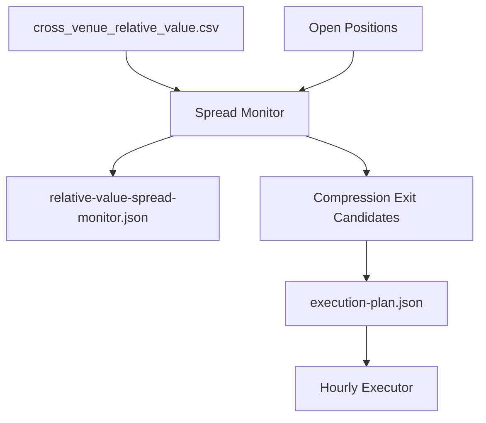

# Heatmap Spread Monitor And Compression Exit Plan

## Scope

Add two pieces to the existing heatmap/engine flow:

- A dedicated spread monitor that records `PM - model`, absolute edge, z-score, DTE, liquidity, flags, and realized convergence for one-touch heatmap rows.
- A deterministic exit rule for live `ONE_TOUCH_HIGH_EDGE_NO` positions when the original edge has compressed enough, for example from `>=15` to `<5` or by `50-70%` from entry.

This should apply first to live one-touch NO positions, not buy-YES positions, because the live strategy currently only promotes `ONE_TOUCH_HIGH_EDGE_NO`.

## Implementation Path

1. Extend one-touch position metadata in `/Users/johnskapwingpc/Downloads/polymarket-trader/scripts/trading-engine.ts`:
  - When building a `ONE_TOUCH_HIGH_EDGE_NO` position from a heatmap row, store entry spread metadata on the position, likely under a new optional field such as `relativeValueEntry`.
  - Include: `marketId`, `eventSlug`, `modelVersion`, `entryEdgePts`, `entryPmYesPrice`, `entryModelProb`, `entryDteDays`, `entryLiquidity`, `entryFlags`, and `bestExpression`.
  - Keep this metadata passive for old positions; do not require migration for non-heatmap positions.
2. Add a spread monitor builder in `/Users/johnskapwingpc/Downloads/polymarket-trader/scripts/trading-engine.ts`:
  - Join current `relative-value/cross_venue_relative_value.csv` rows to open Polymarket positions by `eventSlug::marketId`.
  - Compute current metrics:
    - `currentEdgePts`
    - `currentAbsEdgePts`
    - `edgeCompressionPct = 1 - currentAbsEdge / entryAbsEdge`
    - `dteDays`
    - `pmYesPrice`, `optionsTouchAdjustedProb`, `liquidity`, `pmSpread`, `flags`
    - basic z-score against recent archived rows for the same market if enough observations exist.
  - Write a compact artifact, e.g. `/Users/johnskapwingpc/Downloads/polymarket-trader/data/relative-value-spread-monitor.json`, so we can inspect convergence independently of executions.
3. Add deterministic compression exits in the hourly engine:
  - Add a new mechanical/policy close reason, likely `spread_compressed`, to the closed-trade reason union and CSV handling.
  - Before opening new trades, evaluate open `ONE_TOUCH_HIGH_EDGE_NO` positions against the monitor.
  - Close when either:
    - `entryAbsEdge >= 15` and `currentAbsEdge < 5`, or
    - `edgeCompressionPct >= 0.60` by default.
  - Require a sane current quote before closing:
    - row still exists,
    - liquidity still available,
    - PM spread is not extreme,
    - current exit bid exists for the held instrument.
  - If current row is missing or quote quality is bad, record monitor status but do not force-close.
4. Keep minute scanner conservative:
  - Do not put model-based spread exits in `/Users/johnskapwingpc/Downloads/polymarket-trader/scripts/position-exit-scanner.ts` initially, because it does not load the heatmap/options model and should remain lightweight.
  - Let the minute scanner continue only target/stop/expiry/breakeven behavior.
  - Hourly engine handles PM-vs-model convergence exits.
5. Extend generated artifacts and wrappers:
  - Add `data/relative-value-spread-monitor.json` to the VPS/GitHub wrapper file lists if we want it committed like `engine-state.json` and `execution-plan.json`.
  - Include monitor summaries in `engine-state.json` or `candidate-actions.json` only if useful for LLM visibility; execution should remain deterministic and not LLM-dependent.
6. Validate with dry runs:
  - Run `npm run build`.
  - Run heatmap generation.
  - Run `npx tsx scripts/trading-engine.ts --dry-run --no-llm` and verify:
    - monitor artifact is written,
    - no protected state mutates,
    - BTC/OIL live candidates still appear normally,
    - any compression exit appears only as a candidate in dry run.
  - If possible, simulate one known open heatmap position with mocked entry metadata to verify the `<5` and `>=60% compression` rules.

## Data Flow

## Default Rules

- Entry threshold remains `>=15` absolute edge.
- Compression exit triggers at `currentAbsEdge < 5` or `>=60%` gap compression.
- Do not exit on missing model rows or bad quote quality.
- Apply to live `ONE_TOUCH_HIGH_EDGE_NO` first; keep buy-YES as monitoring/shadow only.

